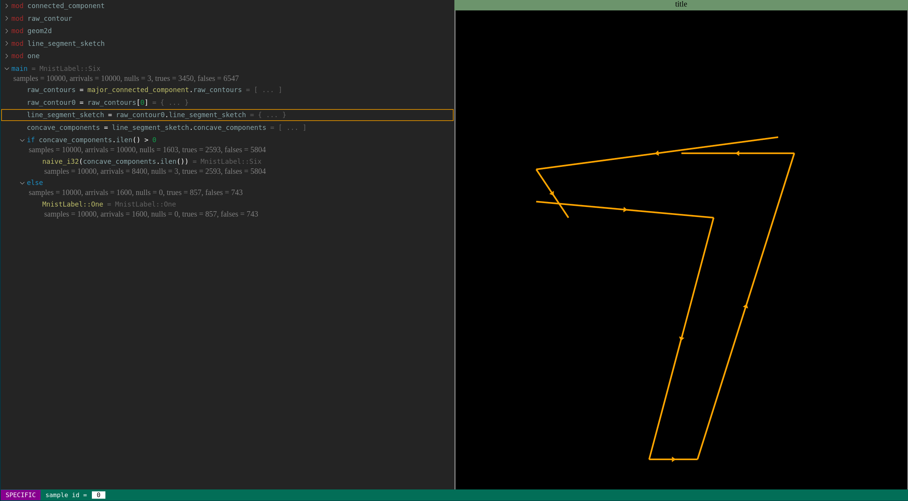

# Husky

The Husky Programming Language

Make programming great again!

:warning: this repo is still under heavy construction: documentation is still serious lacking, number of todos are above 2000, and rustc warnings are everywhere!

## Introduction

Husky is a research oriented programming language that aims primarily to extend the boundary of programming itself (rather than replacing certain languages in certain domains). For example, Husky shall make it possible to write a strongly explainable and efficient classifier for image recognition tasks by using a more powerful functional programming paradigm combined with eager ones and faciliated by a builtin debugging system ... (todo: phrase this more properly;)

The primary focus is the language frontend design. In a long time, Husky will rely on Rust/Zig/C/Cpp for compilation so that we don't need to spend too much time in dealing with IRGen.

## Motivation

### A Bright Future of AI

The core belief is the existence of a strongly explainable program (as explainable as the software we wrote) for a range of AI problems, including computer vision, natural language processing. And Husky is designed to be the language to write that program.

Now "explainability" is important for two reasons:

- allows people to collaborate
- allows task specific optimization

## Designs

### Pythonic Syntax

### Powerful yet Safe Semantics

Three paradigms:

- eager procedural, like C/C++/Rust/python
- eager functional, like OCaml
- lazy functional, like Haskell but advanced to a higher level for the need of machine learning, gui, etc

### Trace-Based Debugging System

#### generic viewpoint: visualize feature over a subset of datapoints

#### specific viewpoint: visualize feature at a fixed datapoint

#### visualization can be customed in type definition

TODO

## About Development

This project was created by and is currently maintained solo by Xiyu Zhai, a Phd in MIT EECS, whose primary background is actually in pure math and has just programmed intensively for the last two years. So please help, smart people!

It was created as a language to implement certain ideas for efficient image classification, which is hard to do in existing languages. Originally it was written in C++, and had gone through many versions that were influenced heavily by C++. However, the lacking of clean pattern matching (like Rust enum) and memory safety and many other things matching make development hard. Then, a Rust version was created from scratch and despite of the learning curve, the development is quite smooth and the design of language is becoming very similar to Rust. Still, value binding is syntactically similar to that of C++ because of succinctness, whereas semantically safety is still guaranteed, just like in Rust.

## Khala Links

### Repositories

#### language

Interesting new languages

Lean 4 <https://github.com/leanprover/lean4/>

Zig <https://github.com/ziglang/zig.git/>

### research

Torch Quantum <https://github.com/mit-han-lab/torchquantum/>

## Youtube Channels

### programming

Rust <https://www.youtube.com/c/RustVideos/>

Niko Matsakis <https://www.youtube.com/user/nikomatsakis/>

Healthy Software Developer <https://www.youtube.com/c/JaymeEdwardsMedia/>

Jon Gjengset <https://www.youtube.com/c/JonGjengset/>

ThePrimeagen <https://www.youtube.com/c/ThePrimeagen/>

### huskies

Gone to the Snow Dogs <https://www.youtube.com/gttsd/>

Maya Husky <https://www.youtube.com/c/MayaHusky/>

K'eyush The Stunt Dog <https://www.youtube.com/c/KeyushTheStuntDog/>

Gohan The Husky <https://www.youtube.com/c/GohanTheHusky/>

Skaya Siberian <https://www.youtube.com/c/SkayaSiberian/>

Sixty Formula <https://www.youtube.com/c/SixtyFormula/>
