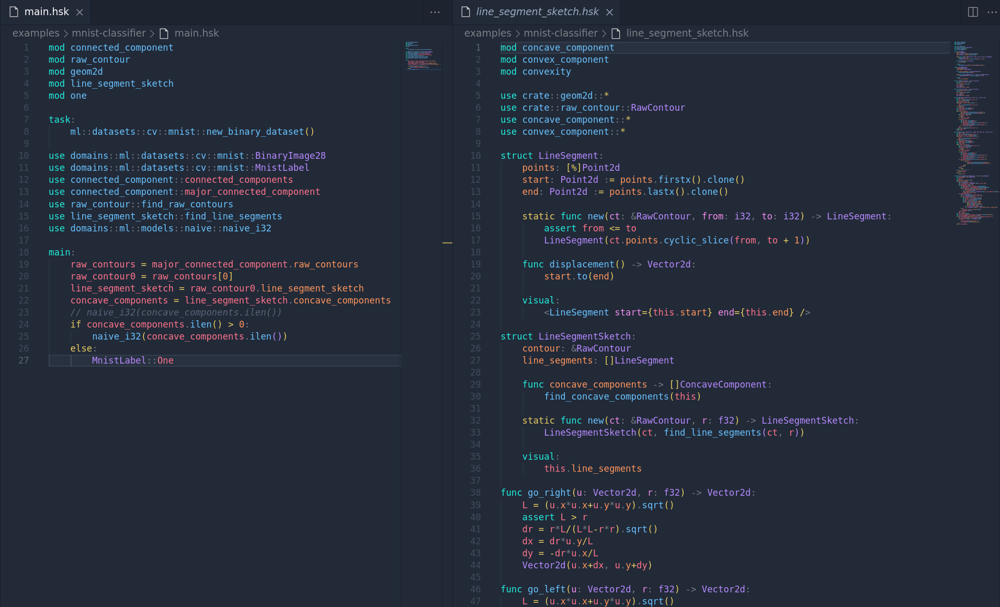
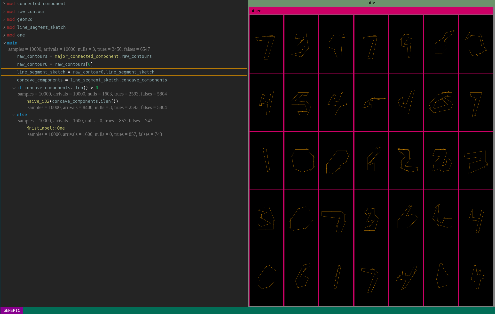

# The Husky Programming Language

(Work In Progress, 3\~4 years away from version 0.1, 10\~15 years from stable version. However, it will be good enough to be used for research in a few month)

Husky is primarily a research language, which doesn't mean language for programming language research, but **language for computer science research in general**. So it's born with ergonomics in mind. It's going to be easy to use and polished like any industrial language, and even better than that.

Husky is designed for **next generation computing**, which vastly generalizes nowadays AI and software. It **combines good designs from various current languages and promises killer applications beyond people's imagination**.

Husky is **true open software**. It will be the core building block of open source AGI owned by all humanity alike.

## New Sheriff in Town

It serves as a 🚀blazingly fast🚀 language with a **uniformed** and much more **ergonomic** developing experience for all the following tasks

- system level programming like Rust and C/C++ and Zig
- web/native frontend development like JavaScript/TypeScript
- parser/compiler like Ocaml/Haskell
- game development
- formal verification and theorem proving like Coq/Lean
- machine learning and data science as we know it today like python
- IDE extension client like JavaScript/TypeScript
- scientific computing like Mathematica, python, Matlab and Julia

But even more importantly, it is **powerful enough for many difficult tasks which haven't yet been seen as programmable at all**, including

- fully explainable model image classification that is as accurate as deep learning with much better efficiency and robustness, see [vision a programming approach](https://github.com/xiyuzhai-husky-lang/impress/blob/main/vision_a_programming_approach.md) for details
- fully explainable, effective and efficient natural language processing (TBA)
- fully explainable, effective and efficient reinforcement learning (TBA)
- ...

It achieves this "seemingly ambitious" goal via the followings:

- a truly powerful type system, inspired mostly by Rust, C++, Haskell, Ocaml and Lean4. The type system is powerful enough to express both system-level details and mathematical rigor.
- ascension mechanism for human in-the-loop, inspired by python deep learning frameworks and scientific computing languages including Mathematica, Matlab, Julia, etc. It allows one to effortlessly switch back and forth between human programming(software engineering) and machine automation(AI). Software engineering and AI is seen as special cases of a general process that combines human intelligence, data, and machine computing into making a useful program. For details, see [todo](impress/ascension.md)
- first class support for debugging, visualization and human computer interaction, inspired by JSX and TSX. This is critical for many things (todo). For details see [todo](impress/notebook.md)
- agile compilation and evalution
- support multiparadigm in a clean way. The high level code is always functional, procedural ... TODO
- commitment to a good ecosystem, inspired by Cargo. Corgi/Documentation/Rigor.Security.

## Development History

### Origin

It started as a personal project of Xiyu Zhai, an EECS PhD. In his third year, he was stroke by some interesting ideas in computer vision which could probably be used to craft models that is far more superior than deep learning. But frustrated by the insufficiency of current languages for implementing these ideas, it appeared to him a new language should be created. So the Husky language was born. 

The first versions of Husky is writing with C++, which is abundant soon after a year due to the inefficiency in writing the compiler, as it lacks support for algebraic data type, memory safety and many other basic things. Soon after, a rust-based version was created. In the process, Husky absorbs many good things from Rust, especially the design of `rust-analyzer` and `cargo`.

However, TODO

## Call for Contribution

Husky is not only an open-source project of coding, but is also an open project of research, which means anyone is welcome to join at any time. For example, we currently have an ongoing project on ImageNet which will take 16 months to complete. It's going to involve 100+ people in the final paper. So anyone interested can first join in the project and learn and master coding techniques and machine learning and algorithmic techniques. Afterwards, one can apply the knowledge to other project he or she feel interested in. We'll give everyone full suppport in their own projects using the Husky programming language.

Roughly speaking, contributors can play two roles:

- husky language user. Use the language to do amazing things, like machine learning, reinforcement learning, frontend development, etc. A user in the early stage will help demonstrate the power of the new language, and also help eliminate bugs and improve the design.
- Husky language developer. Design and implementation. TODO

Contribution will be faithfully recorded. Those who made innovative contribution will become authors in the corresponding papers.

### Husky Language User

After the husk language is completed, we can use Husky language to deal with all the task that deep learning can do. We are currently gathering strength to solve the basic problem in the CV task, ImageNet classification, which can be used as the basis for other tasks. 

We divide 1000 categories of ImageNet into 100 subtasks, and each person is responsible for no more than 10 categories. Each task requires limited time and effort. In the process you will gain a deeper understanding of Husky's principles.
### Husky Language Developer

Develop new compiler for Husky. We are currently considering the design of incremental compilation of the husky programming language. Anyone who is interested in this area is welcome to guide us. The husky programming language will avoid many of the pitfalls of rust and julia at the compile stage. The general idea is to intelligently select some functions as dynamic linkage or even interpreted according to the specific domain to avoid unnecessary relinking. We think this is one of the most important directions of PL, we can discuss it first and then find more experts.

TODO

### Zulip

<https://husky-lang.zulipchat.com>

For further details see [CONTRIBUTION.md](CONTRIBUTING.md)

## Getting Started

### Prerequisites

Make sure rust toolchains are installed. To install vscode extension, npm is also required currently.

### Installation

TODO

What will probably work is,

```sh
git clone https://github.com/husky-lang-org/husky
cd husky
```

then in one terminal do

```sh
cd gui/husky-tracer-gui-sycamore
trunk serve
```

in another terminal do

```sh
make mnist-compiled
```

then in browser open `localhost:8080`.
## Showcase

## Designs

### Pythonic Syntax



### Powerful yet Safe Semantics

All these are possible:

- eager procedural, like C/C++/Rust/python
- eager functional, like OCaml
- lazy functional, like Haskell but advanced to a higher level for the need of machine learning, gui, etc

No interop is needed! (Interop destroys debugging experience, it's good to avoid)

### Everything is Configurable

Husky doesn't make premature assumptions about execution model and memory management.

#### configurable execution

All these are possible:

- interpretation
- compiled to binary
- jit

#### memory management

All these are possible:

- individual alloc/dealloc
- batch alloc/dealloc for (&'eval)
- tracing garbage collector
- automatic refcounting

### Trace-Based Debugging System

Debugging should be as easy as writing the code itself!

Usually devs are designed for procedural languages, because functional ones don't seem to need one. However, the programming problems solved by Husky is intrinsically much harder that a dev is needed even all code is pure functional. For example, in computer vision, blablabla. The major time cost of debugging is to find which line is wrong.

#### generic viewpoint: visualize feature over a subset of datapoints



#### specific viewpoint: visualize feature at a fixed datapoint


#### visualization can be customed in type definition

TODO

## Resources

- the Husky Book: TODO
- the Husky Development Book: TODO
- the Husky Machine Learning Book: TODO
- the Husky Frontend Book: TODO
- the Husky Theorem Proving Book: TODO
- the Husky Formal Verification Book: TODO

## Source Code Organization

The Husky source code is organized as follows:

| Directory         | Contents                                                           |
| -                 | -                                                                  |
| `crates/`         | source code for language implementation in Rust                    |
| `library/`        | source code for official library packages                          |
| `Specs/`          | source code for language specification in Lean4                    |
| `docs/`           | documentation                                                      |
| `examples/`       | examples of husky                                                  |
| `extensions/`     |                                                                    |
| `forks/`          | forks of some 3rd party dependencies                               |
| `gui/`            | various frontend                                                   |
